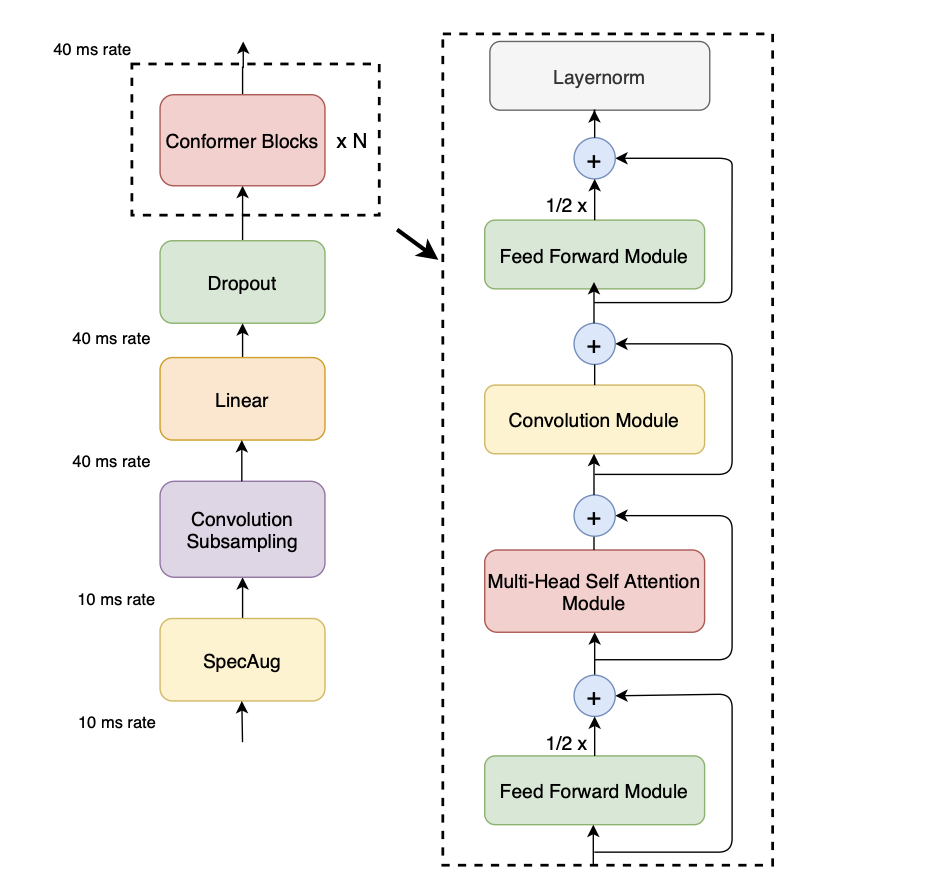
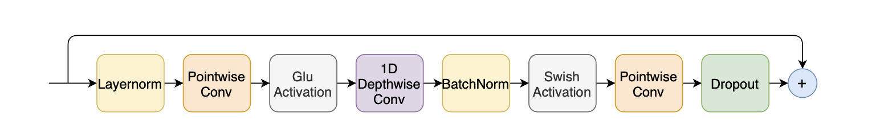
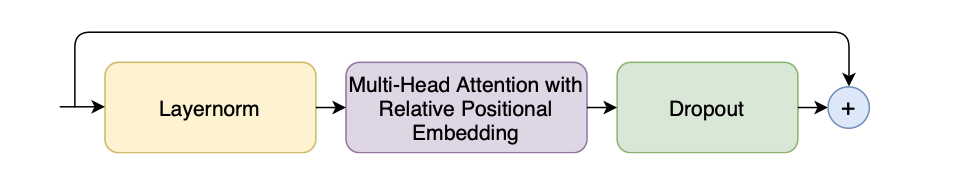
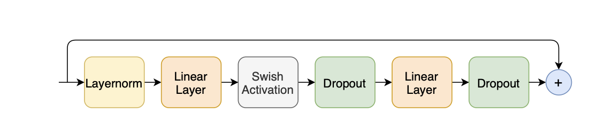

# Conformer ASR on Librispeech

<hr>

## Contents

1. [Highlights](#Highlights)
2. [Requirements](#Requirements)
3. [Usage](#Usage)
4. [Citations](#Citations)


<hr>

## Highlights
This project is an implementation from scratch of the automatic speech recognition transformer model Conformer introduced in the paper [Conformer: Convolution-augmented Transformer for Speech Recognition](https://arxiv.org/pdf/2005.08100.pdf).

The recent end-to-end ASR models are typically composed of an encoder, which takes as input a speech signal (i.e., sequence of speech frames) and extracts high-level acoustic features, and a decoder, which converts the extracted features from the encoder into a sequence of text. The model architecture of the encoder determines the representational power of an ASR model and its ability to extract acoustic features from input signals. Therefore, a strong architecture is critical for overall performance.

The Conformer architecture has been widely adopted by the speech community and is used as a backbone for different speech tasks. At a macro-level, Conformer incorporates the Macaron structure comprised of four modules per block, as shown in the following figure: 

</img>

The hybrid attention-convolution structure enables Conformer to capture both global and local interactions. The convolution module, shown below, contains a pointwise convolution with an expansion factor of 2 projecting the number of channels with a GLU activation layer, followed by a 1-D Depthwise convolution. The 1-D depthwise conv is followed by a Batchnorm and then a swish activation layer.

</img>

The Conformer model uses multi-headed self-attention module with relative positional embedding in a pre-norm residual unit.

</img>

The feed-forward module's first linear layer uses an expansion factor of 4 and the second linear layer projects it back to the model dimension. The module uses the swish activation and a pre-norm residual unit.

</img>

<hr>

## Requirements
```shell
pip install -r requirements.txt
```

<hr>

## Usage
To replicate the reported results, clone this repo
```shell
cd your_directory git clone git@github.com:jordandeklerk/Conformer.git
```
and run the main training script
```shell
python main.py 
```

<hr>

## Citations
```bibtex
@misc{gulati2020conformer,
    title   = {Conformer: Convolution-augmented Transformer for Speech Recognition},
    author  = {Anmol Gulati and James Qin and Chung-Cheng Chiu and Niki Parmar and Yu Zhang and Jiahui Yu and Wei Han and Shibo Wang and Zhengdong Zhang and Yonghui Wu and Ruoming Pang},
    year    = {2020},
    eprint  = {2005.08100},
    archivePrefix = {arXiv},
    primaryClass = {eess.AS}
}
```
